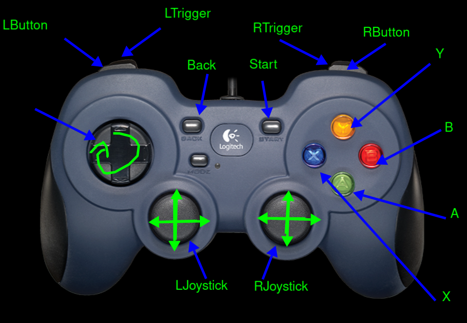

# Robot Controls
  
Name ________________________________________________

### Drive Controls (choose one)
- [ ] Tank Drive
  - format demo'd in the workshop
  - y axis of each joystick controls corresponding side of drivetrain
- [ ] Arcade Drive
    - one joystick y axis controls acceleration
    - one joystick x axis controls the steering
    - can be on the same joystick or different ones
    
(Fill for Arcade Drive) | _ | _
--|--|--
acceleration joystick (circle one) | L | R 
steering joystick (circle one) | L | R 

## Subcomponent Controls
